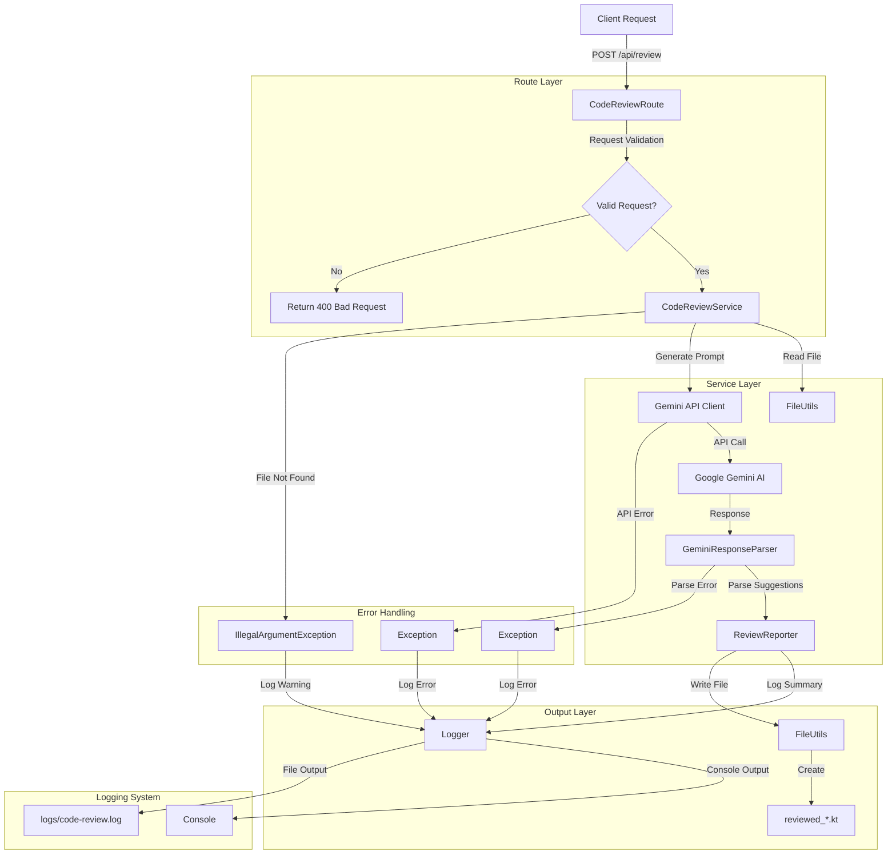

# Code Review Tool Architecture

## Overview
The Code Review Tool is a Kotlin-based web service that leverages Google's Gemini AI to perform automated code reviews. This document outlines the architecture, components, and their interactions.

## System Architecture



## Component Details

### 1. Entry Point (Client Request)
- **Endpoint**: `POST /api/review`
- **Request Body**:
  ```json
  {
    "fileName": "path/to/file.kt",
    "language": "kotlin",
    "model": "gemini-2.0-flash"
  }
  ```
- **Purpose**: Initiates the code review process

### 2. Route Layer (`CodeReviewRoute`)
- **Responsibilities**:
  - Request validation
  - HTTP response handling
  - Error handling
  - Dependency injection
- **Dependencies**:
  - Ktor routing
  - Koin DI
  - SLF4J logging
- **Error Handling**:
  - 400 Bad Request: Invalid input
  - 500 Internal Server Error: Processing errors

### 3. Service Layer (`CodeReviewService`)
- **Core Orchestrator**:
  - Coordinates review process
  - Manages component interactions
  - Handles business logic
- **Key Operations**:
  - File reading
  - Prompt generation
  - AI integration
  - Response processing
  - Report generation

### 4. File Operations (`FileUtils`)
- **Responsibilities**:
  - File I/O operations
  - Path handling
  - File validation
- **Operations**:
  - `readFile`: Reads source code
  - `writeUpdatedFile`: Creates reviewed version
- **Error Handling**:
  - File not found
  - Permission issues
  - I/O errors

### 5. AI Integration (`GeminiApiClient`)
- **Responsibilities**:
  - API communication
  - Authentication
  - Request/Response handling
- **Configuration**:
  - API key management
  - Base URL configuration
  - Model selection
- **Error Handling**:
  - Network errors
  - API errors
  - Authentication failures

### 6. Response Processing (`GeminiResponseParser`)
- **Responsibilities**:
  - JSON parsing
  - Data extraction
  - Error handling
- **Output**:
  - Structured suggestions
  - Updated code
  - Error messages
- **Error Handling**:
  - Invalid JSON
  - Missing fields
  - Format errors

### 7. Reporting (`ReviewReporter`)
- **Responsibilities**:
  - Summary generation
  - Comment formatting
  - Output creation
- **Output Types**:
  - Console logs
  - File comments
  - Review summary
- **Formatting**:
  - Timestamps
  - Line numbers
  - Code snippets

### 8. Logging System
- **Framework**: SLF4J with Logback
- **Configuration**:
  - Console appender
  - File appender
  - Log levels
- **Log Types**:
  - INFO: Normal operations
  - WARN: Potential issues
  - ERROR: Critical failures
- **Output Locations**:
  - Console: Immediate feedback
  - File: `logs/code-review.log`

### 9. Error Handling
- **Types of Errors**:
  - Validation errors
  - File system errors
  - API errors
  - Parsing errors
- **Error Responses**:
  - HTTP status codes
  - Error messages
  - Stack traces
- **Logging**:
  - Error level logging
  - Stack trace logging
  - Context information

### 10. Output Files
- **Reviewed Code**:
  - Original code
  - Review comments
  - Suggested changes
- **Log Files**:
  - Daily rotation
  - Size limits
  - Retention policy

## Data Flow

1. **Request Processing**
   ```
   Client Request → Route Validation → Service Processing
   ```

2. **Code Review**
   ```
   File Reading → AI Analysis → Response Parsing → Report Generation
   ```

3. **Output Generation**
   ```
   Report → Logging → File Writing → Client Response
   ```

## Error Handling Flow

1. **Validation Errors**
   ```
   Invalid Request → Warning Log → 400 Response
   ```

2. **Processing Errors**
   ```
   Error Occurrence → Error Log → 500 Response
   ```

3. **File System Errors**
   ```
   File Error → Error Log → Appropriate Response
   ```

## Logging Flow

1. **Normal Operation**
   ```
   Operation → INFO Log → Console/File
   ```

2. **Warning Conditions**
   ```
   Warning → WARN Log → Console/File
   ```

3. **Error Conditions**
   ```
   Error → ERROR Log → Console/File
   ```

## Security Considerations

1. **API Security**
   - API key management
   - Secure storage
   - Environment variables

2. **File System Security**
   - Path validation
   - Permission checks
   - File access restrictions

3. **Input Validation**
   - Request validation
   - File type checking
   - Size limits

## Performance Considerations

1. **File Operations**
   - Efficient reading/writing
   - Buffer management
   - Resource cleanup

2. **API Calls**
   - Connection pooling
   - Timeout handling
   - Retry mechanisms

3. **Logging**
   - Async logging
   - Buffer management
   - Rotation policies 